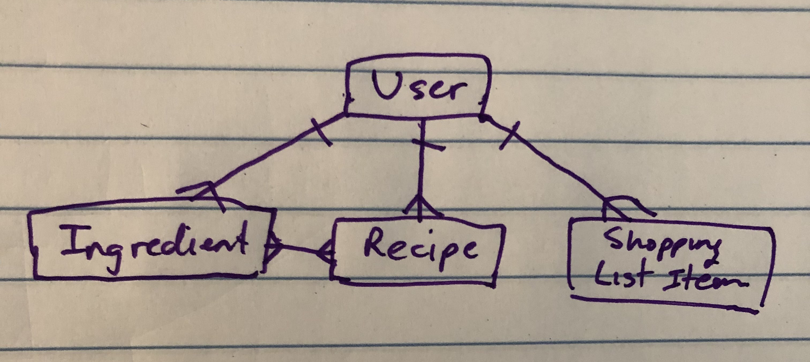
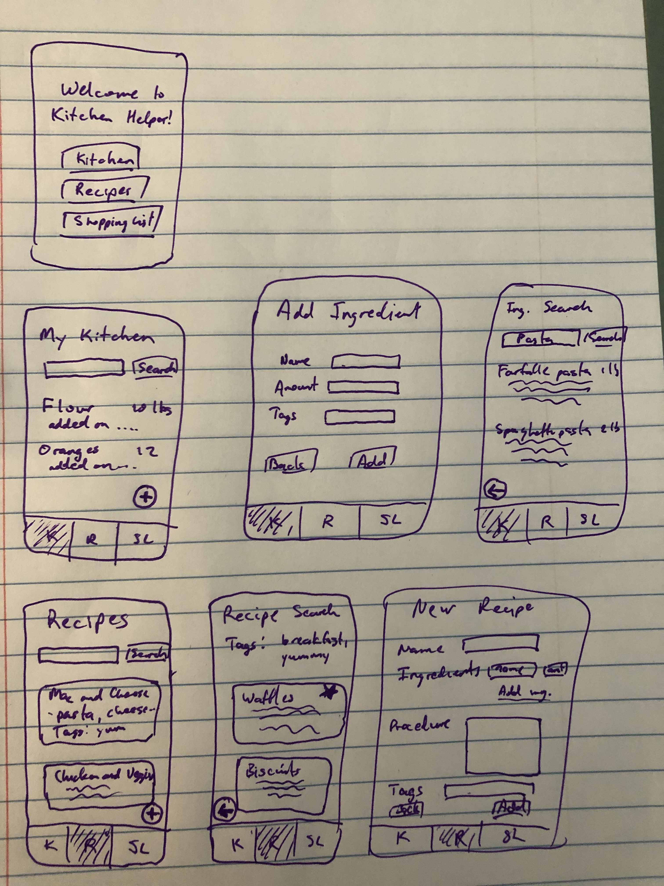
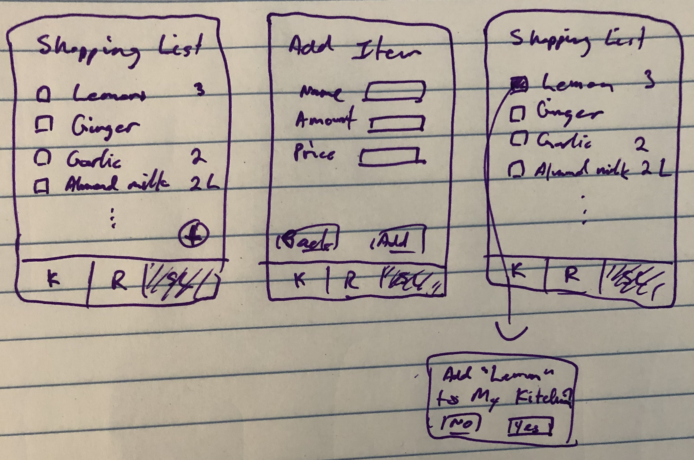

# Kitchen Helper App concept
A kitchen organizer app to keep track of what's in your fridge (and shelves, and pantry...) and what recipes could be made with it. Keeps track of all ingredients in the bank and removes them whenever the user selects that they've made a recipe. Comes with a shopping list that integrates seamlessly into the ingredient bank (automatically prompts you to add to the list when you run out) and the recipe bank (prompts you to add to the list if you're missing ingredients for a recipe).

# Planning
## User Stories
As a user, I want to...
1. ✅ log in with a username and password to gain access to the app's functionality. [AUTH]
1. ✅ view a homepage hub for the My Kitchen, Recipe Assistant, and Shopping List functionality below. [INDEX]
1. have an app that's completely mobile-friendly.
1. have an app that's clean, organized, and simple on the front end.

## My Kitchen
As a user, I want to...
1. ✅ enter an ingredient into My Kitchen, specifying how much I have on hand and whatever tags I want to give it. [NEW]
1. view all of the ingredients, or filter my ingredients by tags. [SHOW]
1. ✅ edit, change the amounts of, re-tag, or delete anything in My Kitchen. [EDIT/DELETE]
1. be smoothly prompted to add an ingredient to my Shopping List if I've just deleted it or run out of it. [UPDATE]
1. ✅ "favorite" an ingredient for easy access/visibility.

### Stretch Goals
1. have smart matching/autocompletion to streamline ingredient entry. [NEW/EDIT]
1. have the app automatically handle common unit conversions when adding or removing ingredients. [UPDATE]
1. keep track of expiration dates and send alerts when something in My Kitchen will go bad soon. [SHOW]
1. use the same ingredient library as another user (ex. if I'm living with someone).

## Recipe Assistant
As a user, I want to...
1. have some recipes come preinstalled on the app, if I want them. [SEED from recipe API]
1. ✅ add my own recipes to the app. [NEW]
1. be able to view recipes or filter with various custom parameters. [SHOW]
    - ✅ **Core design concept: given the ingredients and their quantities in My Kitchen, display all the recipes that can be made with them**.
1. ✅ edit any prebuilt recipes or recipes that I have added. [EDIT]
1. ✅ delete any prebuilt recipes or recipes that I have added. [DELETE]
1. ✅ select "I made this recipe!" and have the corresponding ingredients automatically deducted from My Kitchen. [UPDATE]
1. rate recipes that I've made and add comments/notes to them. [NEW]
    - edit my rating. [EDIT]
    - edit or delete comments/notes. [EDIT/DELETE]
1. ✅ automatically add missing recipe ingredients to the Shopping List. [UPDATE]
1. ✅ "favorite" a recipe for easy access/visibility.
1. tag and categorize recipes -- "breakfast", "dinner", "snack", "dessert", etc. [EDIT/SHOW]

### Stretch Goals
1. set certain ingredients in recipes as "optional", for enhanced filtering and meal planning. [SHOW]
1. filter recipes that are only missing optional ingredients, or missing up to some number of ingredients. [SHOW]
1. share some or all of my recipes with a friend, so that they can view them from their account as well. [AUTH]

## Shopping List!
As a user, I want to...
1. ✅ add items to, edit items in, or remove items from my Shopping List. [NEW/EDIT/DELETE]
1. ✅ check items off of the Shopping List to indicate a purchase. [EDIT]
1. ✅ be smoothly prompted to add an ingredient to My Kitchen once ~~it's checked off on the Shopping List~~ the shopping trip is complete. [NEW]

### Stretch Goals
1. be able to see who added an entry to the Shopping List and, if applicable, which recip(s) the entry came from. [INDEX]
1. save product templates to my Shopping List, so I can select a saved product and amount (and potentially price?) instead of entering one from scratch every time. [NEW]

## General Workflow
All of the functionalities of this app can be enhanced with data from the other functionalities, but are at their core fundamentally independent, which  simplifies the workflow greatly.
1. ✅ I will first implement the **self-contained** portions of each of the three key features (My Kitchen, Recipe Assistant, and Shopping List) one by one, as well as creating a rudimentary user account system (users must create an account and log in to use the app).
    - This will be considered my MVP.
1. ✅ Once the MVP is working and the three components function independently, I will begin linking them together in the ways described above.
1. ✅ I will begin by linking My Kitchen to the Shopping List, as it is the most straightforward relationship and will not break anything.
1. ✅ I will then link My Kitchen to the Recipe Assistant, which will be somewhat more complicated.
1. Finally, I will link the Recipe Assistant to the Shopping List, which is also somewhat involved.
1. If I have extra time after this, I'll tackle the stretch goals in whatever order makes the most logical sense for implementation.

## Models
### User
- username
- password hash
- first name
- [ingredients]
- [recipes]
- [shopping list items]
- id

### Ingredient
- name
- amount
- [tags]
- timestamp
- "favorite" flag
- id
- added by (stretch goal)
- expiration (stretch goal)

### Recipe
- name
- [{ingredient name, ingredient amount}]
    - "optional" flag (stretch goal)
- "favorite" flag
- step-by-step
- [tags]
- [comments]
- id
- added by (stretch goal)

### Shopping List Item
- name
- amount
- price (stretch goal)
- id

### ERD

## Route Table
| Name      | Path              | HTTP  | Description |
| ----      | ----              | ----  | ----------- |
| ✅ Index     | /kitchen          | GET   | Displays all ingredients in My Kitchen |
| ✅ New       | /kitchen/new      | GET   | Displays form to add an ingredient to My Kitchen |
| ✅ Create    | /kitchen          | POST  | Adds a new ingredient to My Kitchen |
| ✅ Show      | /kitchen/:id      | GET   | Shows information on one specific ingredient |
| ✅ Edit      | /kitchen/:id/edit | GET   | Displays form to edit information of one ingredient |
| ✅ Update    | /kitchen/:id      | PUT   | Updates information of one ingredient |
| ✅ Destroy   | /kitchen/:id      | DELETE| Deletes one ingredient completely |
| &nbsp;| | | |
| ✅ Index     | /recipes          | GET   | Displays all recipes in the Recipe Assistant |
| ✅ New       | /recipes/new      | GET   | Displays form to add a recipe to the Recipe Assistant |
| ✅ Create    | /recipes          | POST  | Adds a new recipe to the Recipe Assistant |
| ✅ Show      | /recipes/:id      | GET   | Shows information on one specific recipe |
| ✅ Edit      | /recipes/:id/edit | GET   | Displays form to edit information of one recipe |
| ✅ Update    | /recipes/:id      | PUT   | Updates information of one recipe |
| ✅ Destroy   | /recipes/:id      | DELETE| Deletes one recipe completely |
| &nbsp;| | | |
| ✅ Index     | /shoplist         | GET   | Displays the Shopping List |
| ✅ New       | /shoplist/new     | GET   | Displays form to add an item to the Shopping List |
| ✅ Create    | /shoplist         | POST  | Adds a new item to the Shopping List |
| ~~Show~~      | ~~/shoplist/:id~~     | ~~GET~~   | ~~Shows information on one Shopping List item~~ |
| ✅ Edit      | /shoplist/:id/edit| GET   | Displays form to edit information of one Shopping List item |
| ✅ Update    | /shoplist/:id      | PUT   | Updates information of one Shopping List item|
| ✅ Destroy   | /shoplist/:id      | DELETE| Deletes one Shopping List item completely |

## Wireframes

to fix
- kitchen: purge recipe ingRefs when something is deleted
- kitchen: adding a recipe adds an empty tag
- recipe: i broke the buttons oops